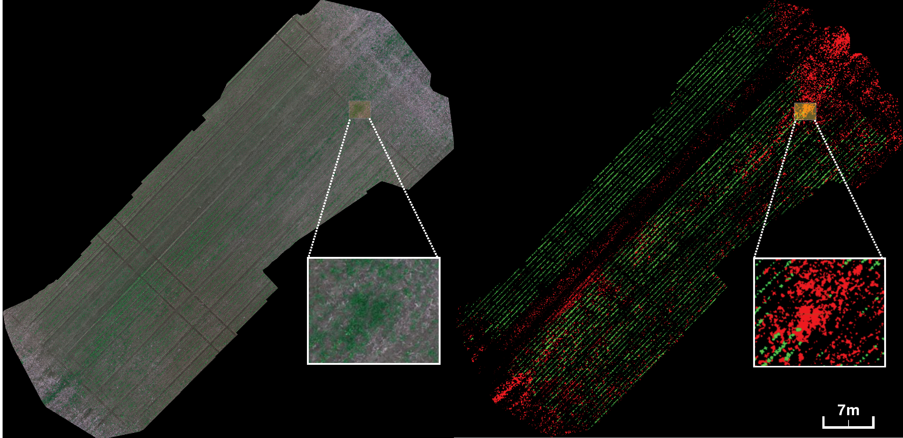

<h1>Deep Learning for Weed Mapping Using Multispectral Imagery Acquired by Drones</h1>

This repository contains the code for the continuous training and operation of a production-level weed mapping detector. These aerial pictures of crops were taken by flying drones, that mount a commercial multispectral camera. The model's objective is to distinguish crops from weeds at the pixel level for a complete orthomosaic map with improved accuracy.

<i>
The model output is an image with the same dimensions as the input orthomosaic map, but with colors that identify automatically crops (green) and weeds (red) at pixel-level.
</i>

<h2>Documentation</h2>
<ul>
  <li> <a href='docs/installation.md'><strong>Installation</strong>: Setting up the project</a> 
  <li> <a href="docs/datasets.md"><strong>Dataset Format</strong>: Creating the HuggingFace Dataset for training and evaluation</a> 
  <li> <a href="docs/configs.md"><strong>Configs and Finetune Training</strong></a>
  <li> <a href="docs/driunet.md"><strong>DriUNet</strong>: Walkthrough for Training DriUNet baseline</a> 
  <li> <a href="docs/auto_driunet.md"><strong>AutoEncoder + DriUNet</strong>: Walkthrough for Training DriUNet with an auntoencoder as compressor</a></li>
  <li> <a href="docs/model_zoo.md"><strong>Model Zoo</strong>: Links to pre-trained checkpoints</a></li>
<ul>